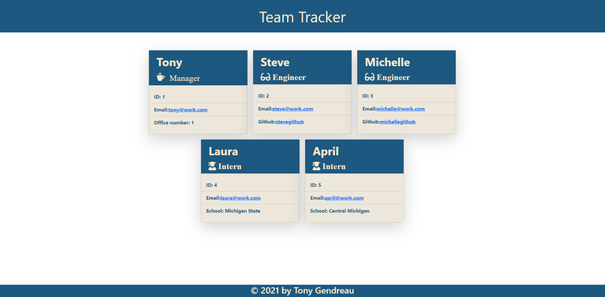

# Team_Tracker
---

  
  
   
   
   
   
   
## Description

Team tracker is a node.js  command-line application that will take in input and generate cards for each team member on a development team.  I designed this app using an Employee class from which Manager, Engineer, and Intern classes inherit.  These classes have both properties and methods.  Each employee card lists the employee ID and their email.  The email is clickable and will open  your email app when clicked.  Depending on the job role it also displays different information.  The manager displays his/her office number.  The engineers also display a clickable link that will take you to their github page in another tab. And lastly interns display the school that they are attending.

---
  ## Table of Contents

  [Features](#features)

  [Screenshot](#screenshot)

  [Installation](#installation)
    
  [Usage](#usage)
    
  [License](#license)
    
  [Contributing](#contributing)
    
  [Tests](#tests)

  [Questions](#questions)
  
  

---

## Features

      1. Used classes to organize the employees. 

      2. Used inheritance to use the DRY principle . 

      3. Used literals to generate the HTML from code. 

      4. Responsive design.

      
---

## Screenshot 
  
  
  

  
  [Here is a link to a video showing me generate a webpage of the team members](https://drive.google.com/file/d/1soa3qjEEMhE1Rb5K3XjW1956j46D0z1M/preview)
  

  ---

  ## Installation

      1. Clone from the github repository. 

      2. Type 'npm install' in the prompt 

---
  ## Usage

      1. type: 'node index.js' from the develop directory. 

      2. Answer the questions on the command line.

      3. Place the generated index.html and the style.css located in the dist folder into the location you want to run the webpage.

  ---
  ## License 

  &emsp; 

      To read about the license of this project click the link below.

  &emsp;[License](https://github.com/tgtiburon/Team_Tracker/blob/main/LICENSE) 

  ---
  ## Contributing

      1. Email me. 

      2. Post a message on the issue tracker on github. 
---
  ## Tests

      1. If you want to run tests type: 'npm install --save-dev jest'

      2. There are tests for each of the classes in the project, for example type:' npm test employee' to test just the employee class.

      3. You could type 'npm test' and it will run tests on all the classes.

---
## Questions

If you have any questions about this project feel free to email me at <tg.tiburon@gmail.com>.  

To see the rest of my portfolio, visit [Github](https://github.com/tgtiburon).

Below is a graphic displaying my most used languages on github.

This Readme file was created with Readme Architect by Tony Gendreau &copy;
